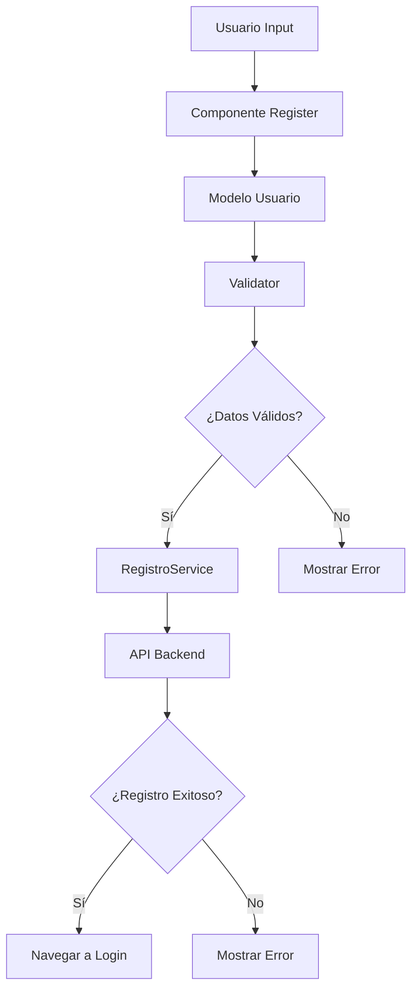

# Validación de Cédula Ecuatoriana y Arquitectura POO del Sistema de Registro

## 📋 Estructura de la Cédula Ecuatoriana

### Formato General

La cédula ecuatoriana consta de **10 dígitos** con la siguiente estructura:

```
XX - Y - ZZZZZZ - D
```

Donde:

- **XX**: Código de provincia (2 dígitos)
- **Y**: Tercer dígito (1 dígito)
- **ZZZZZZ**: Número secuencial (6 dígitos)
- **D**: Dígito verificador (1 dígito)

### Validaciones Específicas

#### 1. Código de Provincia (Primeros 2 dígitos)

- **Rango válido**: 01 a 24
- **Provincias válidas**:
  - 01: Azuay
  - 02: Bolívar
  - 03: Cañar
  - 04: Carchi
  - 05: Cotopaxi
  - 06: Chimborazo
  - 07: El Oro
  - 08: Esmeraldas
  - 09: Guayas
  - 10: Imbabura
  - 11: Loja
  - 12: Los Ríos
  - 13: Manabí
  - 14: Morona Santiago
  - 15: Napo
  - 16: Pastaza
  - 17: Pichincha
  - 18: Tungurahua
  - 19: Zamora Chinchipe
  - 20: Galápagos
  - 21: Sucumbíos
  - 22: Orellana
  - 23: Santo Domingo de los Tsáchilas
  - 24: Santa Elena

#### 2. Tercer Dígito

- **Rango válido**: 0 a 6
- **Significado**:
  - 0-5: Personas naturales nacidas en Ecuador
  - 6: Personas naturales nacionalizadas
  - 7-8: Reservado (no válido para personas naturales)
  - 9: Sociedades del sector público y privado

#### 3. Algoritmo de Validación (Dígito Verificador)

El dígito verificador se calcula usando el **algoritmo de módulo 10**:

1. **Coeficientes**: [2, 1, 2, 1, 2, 1, 2, 1, 2]
2. **Proceso**:
   - Multiplicar cada uno de los primeros 9 dígitos por su coeficiente correspondiente
   - Si el resultado es mayor o igual a 10, restar 9
   - Sumar todos los resultados
   - Calcular el módulo 10 de la suma
   - El dígito verificador es: 10 - (suma % 10)
   - Si el resultado es 10, el dígito verificador es 0

#### Ejemplo de Validación

Cédula: `1234567890`

```
Dígitos:    1  2  3  4  5  6  7  8  9  0
Coeficientes: 2  1  2  1  2  1  2  1  2

Multiplicación:
1 × 2 = 2
2 × 1 = 2
3 × 2 = 6
4 × 1 = 4
5 × 2 = 10 → 10 - 9 = 1
6 × 1 = 6
7 × 2 = 14 → 14 - 9 = 5
8 × 1 = 8
9 × 2 = 18 → 18 - 9 = 9

Suma: 2 + 2 + 6 + 4 + 1 + 6 + 5 + 8 + 9 = 43
Módulo 10: 43 % 10 = 3
Dígito verificador: 10 - 3 = 7

La cédula válida sería: 1234567897 (no 1234567890)
```

---

## 🔒 Validación de Contraseñas Seguras

### Criterios de Seguridad

Una contraseña segura debe cumplir con los siguientes requisitos:

#### ✅ **Requisitos Obligatorios**

1. **Longitud mínima**: 8 caracteres
2. **Al menos una letra minúscula** (a-z)
3. **Al menos una letra mayúscula** (A-Z)
4. **Al menos un número** (0-9)
5. **Al menos un carácter especial** (!@#$%^&\*(),.?":{}|<>)

#### ⚠️ **Criterios Adicionales**

- **Sin espacios en blanco**
- **No debe contener información personal** (nombre, apellido, correo)
- **Longitud recomendada**: 12+ caracteres para máxima seguridad

### Niveles de Fortaleza

La fortaleza de la contraseña se clasifica en 5 niveles:

| Nivel             | Descripción | Color    | Requisitos                          |
| ----------------- | ----------- | -------- | ----------------------------------- |
| 🔴 **Muy Débil**  | Insegura    | Rojo     | < 6 caracteres                      |
| 🟠 **Débil**      | Poco segura | Naranja  | 6-7 caracteres, algunos criterios   |
| 🟡 **Regular**    | Aceptable   | Amarillo | 8+ caracteres, criterios básicos    |
| 🟢 **Fuerte**     | Segura      | Verde    | 8+ caracteres, todos los criterios  |
| 🔵 **Muy Fuerte** | Muy segura  | Azul     | 12+ caracteres, todos los criterios |

### Algoritmo de Evaluación

```javascript
static evaluarFortalezaPassword(password) {
  let puntuacion = 0;
  let nivel = 'muy-debil';

  // Longitud
  if (password.length >= 8) puntuacion += 2;
  else if (password.length >= 6) puntuacion += 1;

  // Caracteres
  if (/[a-z]/.test(password)) puntuacion += 1; // Minúsculas
  if (/[A-Z]/.test(password)) puntuacion += 1; // Mayúsculas
  if (/[0-9]/.test(password)) puntuacion += 1; // Números
  if (/[^A-Za-z0-9]/.test(password)) puntuacion += 1; // Especiales

  // Bonificaciones
  if (password.length >= 12) puntuacion += 1; // Longitud extra
  if (/(?=.*[a-z])(?=.*[A-Z])(?=.*[0-9])(?=.*[^A-Za-z0-9])/.test(password)) {
    puntuacion += 1; // Todos los tipos
  }

  // Determinar nivel
  if (puntuacion >= 7) nivel = 'muy-fuerte';
  else if (puntuacion >= 6) nivel = 'fuerte';
  else if (puntuacion >= 4) nivel = 'regular';
  else if (puntuacion >= 2) nivel = 'debil';

  return { puntuacion, nivel };
}
```

### Implementación Visual

#### Indicador de Fortaleza

- **Barra de progreso** que se llena según la fortaleza
- **Cambio de color** dinámico según el nivel
- **Mensajes informativos** sobre qué mejorar
- **Validación en tiempo real** mientras el usuario escribe

#### Ejemplo de Contraseñas

| Contraseña           | Fortaleza     | Explicación                 |
| -------------------- | ------------- | --------------------------- |
| `123456`             | 🔴 Muy Débil  | Solo números, muy corta     |
| `password`           | 🟠 Débil      | Solo letras, común          |
| `Password1`          | 🟡 Regular    | May., min., números         |
| `Pass@123`           | 🟢 Fuerte     | Todos los criterios         |
| `MySecure@Pass2024!` | 🔵 Muy Fuerte | Larga + todos los criterios |

---

## 🏗️ Arquitectura de Programación Orientada a Objetos (POO)

### Principios Implementados

#### 1. **Encapsulación**

- Cada clase tiene responsabilidades bien definidas
- Los datos están protegidos dentro de las clases
- Se exponen métodos públicos para interactuar con los datos

#### 2. **Separación de Responsabilidades**

- **Modelo**: Gestión de datos del usuario
- **Validación**: Lógica de validación
- **Servicio**: Comunicación con API
- **Vista**: Presentación y manejo de eventos

#### 3. **Patrón Singleton**

- Implementado en `RegistroService` para garantizar una única instancia

### Estructura de Clases

#### 📁 **models/Usuario.js**

```javascript
class Usuario {
  // Propiedades privadas
  constructor(datos = {})

  // Métodos públicos
  toServerFormat()
  esEstudianteUTA()
  actualizarCampo(campo, valor)
}
```

**Responsabilidades**:

- Representar la entidad Usuario
- Validar y formatear datos de entrada
- Convertir datos al formato del servidor
- Manejar lógica específica del dominio

#### 📁 **utils/Validator.js**

```javascript
class Validator {
  // Métodos estáticos para validación
  static validarCedulaEcuatoriana(cedula)
  static validarCelularEcuatoriano(celular)
  static soloLetras(texto)
  static validarLongitudPassword(password, minLength)
  static passwordsCoinciden(password, confirmPassword)

  // Nuevos métodos para contraseñas seguras
  static validarPasswordSegura(password)
  static evaluarFortalezaPassword(password)
  static obtenerSugerenciasPassword(password)
  static contieneMayusculas(password)
  static contieneMinusculas(password)
  static contieneNumeros(password)
  static contieneCaracteresEspeciales(password)
  static validarSinEspacios(password)
}
```

**Responsabilidades**:

- Centralizar toda la lógica de validación
- Implementar algoritmos específicos (cédula ecuatoriana)
- Validar contraseñas seguras con múltiples criterios
- Evaluar fortaleza de contraseñas en tiempo real
- Proporcionar sugerencias para mejorar contraseñas
- Proporcionar métodos reutilizables
- Mantener consistencia en las validaciones

#### 📁 **services/RegistroService.js**

```javascript
class RegistroService {
  // Patrón Singleton
  static getInstance()

  // Métodos de negocio
  async registrarUsuario(datos)
  async obtenerCarreras()
}
```

**Responsabilidades**:

- Manejar comunicación con la API
- Gestionar errores de red
- Formatear respuestas del servidor
- Implementar lógica de negocio

### Ventajas de la Arquitectura POO Implementada

#### ✅ **Mantenibilidad**

- Código organizado en clases con responsabilidades claras
- Fácil localización y modificación de funcionalidades
- Cambios aislados que no afectan otras partes del sistema

#### ✅ **Reutilización**

- Clases pueden ser utilizadas en otros componentes
- Validaciones centralizadas y consistentes
- Servicios compartidos entre múltiples vistas

#### ✅ **Testabilidad**

- Cada clase puede ser probada de forma independiente
- Métodos estáticos facilitan las pruebas unitarias
- Separación clara entre lógica y presentación

#### ✅ **Escalabilidad**

- Fácil agregar nuevas validaciones
- Estructura preparada para nuevas funcionalidades
- Patrón Singleton evita múltiples instancias innecesarias

#### ✅ **Legibilidad**

- Código autodocumentado con nombres descriptivos
- Estructura jerárquica clara
- Separación entre modelo, vista y controlador

### Flujo de Datos en el Sistema



### Convenciones de Nomenclatura CSS

Todas las clases CSS siguen el patrón de identificadores únicos:

- **Formato**: `nombre-clase-{identificador-componente}`
- **Ejemplo**: `.container-page-reg` (reg = Register)

**Beneficios**:

- Evita conflictos entre componentes
- Facilita el mantenimiento de estilos
- Mejora la especificidad de CSS
- Permite identificar rápidamente el origen de los estilos

## 📝 Nuevas Funcionalidades Implementadas

### 🔒 Sistema de Validación de Contraseñas Avanzado

#### Características Principales:

- **Evaluación en tiempo real** de la fortaleza de contraseñas
- **Indicador visual** con barra de progreso y colores
- **Sugerencias específicas** para mejorar la seguridad
- **5 niveles de fortaleza** claramente diferenciados
- **Validación exhaustiva** con múltiples criterios

#### Beneficios de Seguridad:

- **Prevención de contraseñas débiles** antes del registro
- **Educación del usuario** sobre buenas prácticas de seguridad
- **Reducción de vulnerabilidades** en cuentas de usuario
- **Cumplimiento de estándares** de seguridad modernos

### 🎨 Mejoras en la Interfaz de Usuario

#### Indicador de Fortaleza:

```css
.password-strength-reg {
  /* Barra de progreso animada */
  /* Cambios de color dinámicos */
  /* Transiciones suaves */
}
```

#### Estados Visuales:

- 🔴 **Rojo**: Contraseña muy débil o débil
- 🟡 **Amarillo**: Contraseña regular
- 🟢 **Verde**: Contraseña fuerte
- 🔵 **Azul**: Contraseña muy fuerte

---

## 📝 Conclusión

La implementación combina una validación robusta de cédulas ecuatorianas con una arquitectura POO sólida y un sistema avanzado de validación de contraseñas, resultando en un sistema:

- **Confiable**: Validaciones específicas para Ecuador y contraseñas seguras
- **Mantenible**: Código organizado y bien estructurado
- **Escalable**: Fácil de extender y modificar
- **Testeable**: Componentes independientes y bien definidos
- **Seguro**: Protección robusta contra vulnerabilidades comunes
- **Intuitivo**: Interfaz que guía al usuario hacia mejores prácticas

Esta arquitectura establece una base sólida para el desarrollo continuo del sistema de registro de eventos académicos, priorizando tanto la funcionalidad como la seguridad.
